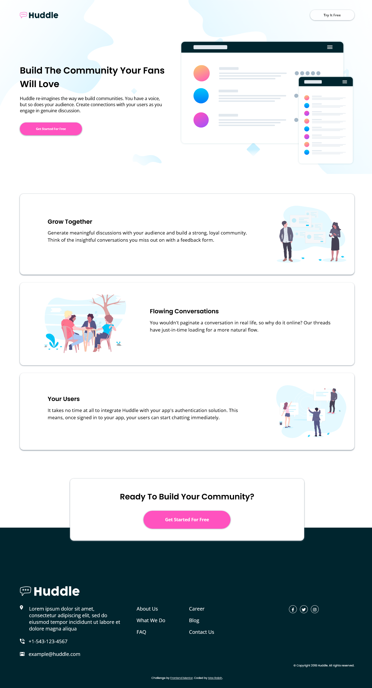

# Frontend Mentor - Huddle landing page with alternating feature blocks solution

This is a solution to the [Huddle landing page with alternating feature blocks challenge on Frontend Mentor](https://www.frontendmentor.io/challenges/huddle-landing-page-with-alternating-feature-blocks-5ca5f5981e82137ec91a5100).

## Table of contents

- [Overview](#overview)
  - [The challenge](#the-challenge)
  - [Screenshot](#screenshot)
  - [Links](#links)
  - [Built with](#built-with)
- [Author](#author)

## Overview

### The challenge

Users should be able to:

- View the optimal layout for the site depending on their device's screen size
- See hover states for all interactive elements on the page

### Screenshot

### Links

- Solution URL: [codepen.io](https://codepen.io/maxralph/pen/XWqJWbQ)
- Live Site URL: [codepen.io](https://codepen.io/maxralph/full/XWqJWbQ)

### Built with

- Semantic HTML5 markup
- CSS custom properties
- Flexbox
- CSS Grid
- Mobile-first workflow

## Author

- Website - [Max Ralph](https://www.max-ralph.com)
- Frontend Mentor - [@maxralph002](https://www.frontendmentor.io/profile/maxralph002)
- Twitter - [@jsuis_maxralph](https://www.twitter.com/jsuis_maxralph)
